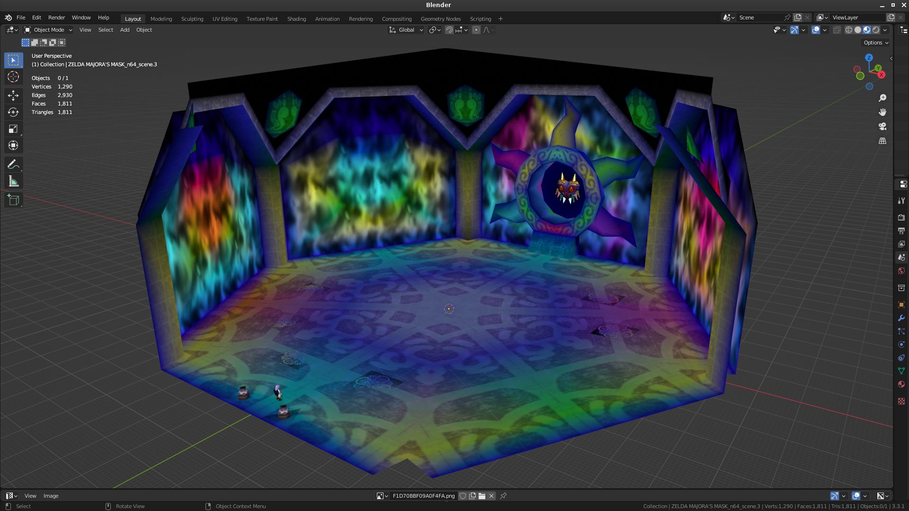

# blender-import-glr
Addon which adds glr import support to Blender, the free 3D modelling suite. 

---

## About

Allows Blender 2.80+ to import GLR scene files, a custom binary file format developed and generated by [GLideN64-SceneRipper](https://github.com/Luctaris/GLideN64-SceneRipper/) for ripping triangle information from N64 games.

## Examples

<picture>
  
</picture>

<picture>
  
</picture>

<picture>
  
</picture>

<picture>
  
</picture>

## Installation

Download the `io_import_glr` folder from this repo and place it into your Blender's addon folder `(Main Blender folder)/(Version)/scripts/addons/`.

You can also try to install the .zip file (in Releases) as a Blender addon via the preferences panel.

## General Usage

1. Open Blender
2. Go to `File->Import->GLideN64 Rip (.glr)`
3. Configure import options on the right-side panel provided by the importer.
- Config explanations listed below
4. (Optional) Select and highlight one or more textures to add to the blacklist/whitelist
5. Select and highlight one or more .glr files to import
6. Import!

## Blacklist Usage

To assist with specifying a blacklist/whitelist for imported files, I added in an operator create a list for you.

1. Go into edit mode on an imported scene
- Note: This operator only displays and works in edit mode!
2. Select the faces containing the material you'd like to blacklist/whitelist
3. Press F3 (or your configured hotkey) to bring up the operator search menu
4. Search for `filter` and you should see an option for `Generate Texture Filter List`
5. Upon usage, you should see a confirmation of the list being generated towards the bottom of your screen.
6. Generated texture list should be copied into your clipboard. You can now paste it into the `Textures` box on next import.
7. (optional) Check your Blender text editor for an entry named `selected_textures` if you want to manually copy the list.

## Config Options

| Option                        | Description                                                                                        |
| ----------------------------- | -------------------------------------------------------------------------------------------------- |
| Transform                     | Will apply specified movement, rotation, and scaling options to each imported scene.               |
| Fog BBox                      | Enables importing of fog information.                                                              |
| Merge Triangles               | Resulting import mesh will have a lot of doubles unless this option is enabled.                    |
| Merge Distance                | Distance to merge by. Modify this for tris very close to each other and not importing correctly.   |
| Modify Color Management       | Blender defaults to using Filmic colors. This option changes the scene to use sRGB colors for you. |
| Enable Material Transparency  | Makes triangles correctly display textures with alpha channels.                                    |
| Display Backface Culling      | Renders face sides based on their normal vector.                                                   |
| Colors - Enable               | Self-explantory.                                                                                   |
| Colors - Invert               | Inverts the RGBA values of each triangle vertice that is imported.                                 |
| Merge Color Alpha             | Multiplies the alpha (A) value from RGBA into each RGB value.                                      |
| Generate Merged Color Channel | A CMBC color attribute will be created which contains a combination of all chosen colors.          |
| Blacklist                     | Whitelist when unchecked. Removes or only allows specified textures.                               |
| Add Textures Button           | Adds selected .png textures in the filebrowser to the textures list.                               |
| Textures                      | Specifies the texture filter list. Appropriate input is `(texture name, no extension),...`         |
| Remove NO_TEXTURE Triangles   | Because NO_TEXTURE triangles do not use a texture, this option was added to blacklist them         |
| Wrap Mode Override            | Allows you to override incorrect wrapmodes on material faces that import incorrectly               |

| Wrapmode Name | Description                                            |
| ------------- | ------------------------------------------------------ |
| WN_WN (0)     | Repeat on X, Repeat on Y                               |
| WN_MN (1)     | Repeat on X, Mirror repeat on Y                        |
| WN_WC (2)     | Repeat on X, Repeat clamped on Y                       |
| WN_MC (3)     | Repeat on X, Mirror repeat clamped on Y                |
| MN_WN (4)     | Mirror repeat on X, Repeat on Y                        |
| MN_MN (5)     | Mirror repeat on X, Mirror repeat on Y                 |
| MN_WC (6)     | Mirror repeat on X, Repeat clamped on Y                |
| MN_MC (7)     | Mirror repeat on X, Mirror repeat clamped on Y         |
| WC_WN (8)     | Repeat clamped on X, Repeat on Y                       |
| WC_MN (9)     | Repeat clamped on X, Mirror repeat on Y                |
| WC_WC (10)    | Repeat clamped on X, Repeat clamped on Y               |
| WC_MC (11)    | Repeat clamped on X, Mirror repeat clamped on Y        |
| MC_WN (12)    | Mirror repeat clamped on X, Repeat on Y                |
| MC_MN (13)    | Mirror repeat clamped on X, Mirror repeat on Y         |
| MC_WC (14)    | Mirror repeat clamped on X, Repeat clamped on Y        |
| MC_MC (15)    | Mirror repeat clamped on X, Mirror repeat clamped on Y |
